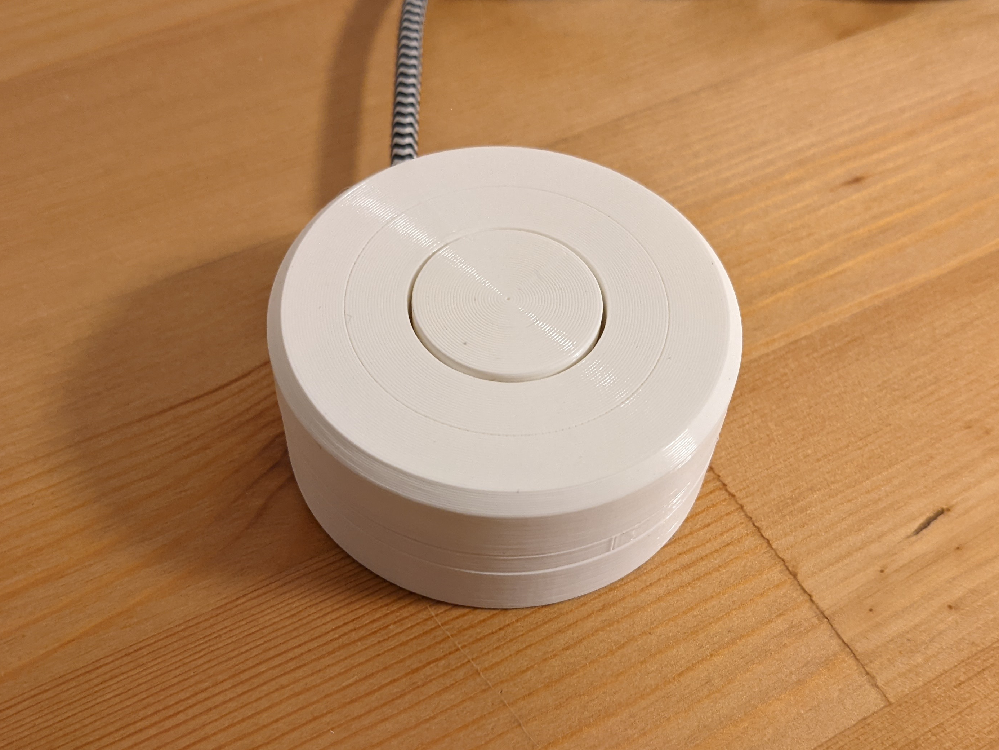
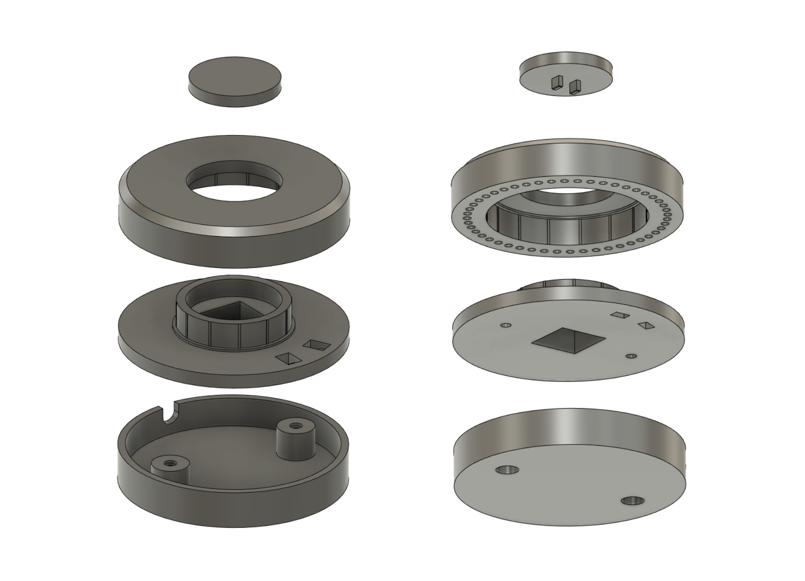
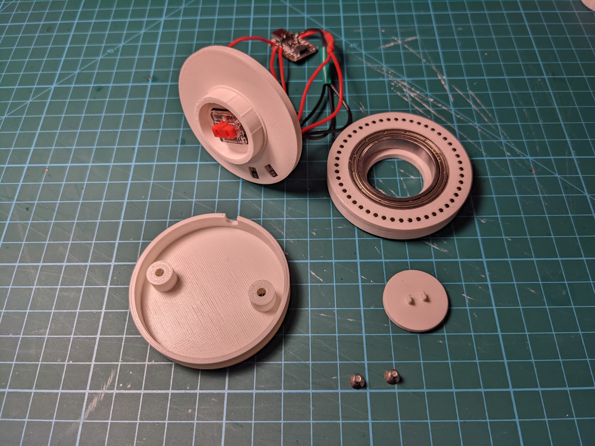

# DIY Surface Dial

This repository contains 3D-printable design files and code that can be used to make a Surface Dial compatible USB radial controller.

The controller doesn't have all the features of the real Surface Dial. It's not wireless, it's not nearly as precise, it doesn't have haptic feedback and it doesn't have the on-screen positioning magic. But it should work in all applications compatible with the Surface Dial with no additional software.

It uses the following components:

* [Adafruit QT Py RP2040](https://www.adafruit.com/product/4900) (you can use any other board that will fit inside the case, but the code is for the RP2040)
* 2x [SS49E Hall effect sensors](https://sps.honeywell.com/us/en/products/sensing-and-iot/sensors/magnetic-sensors/linear-and-angle-sensor-ics/ss39et-ss49e-ss59et-linear-sensor-ics) (TO-92 package)
* 48x 2x2mm neodymium cylinder magnets (axially magnetized)
* Kailh low profile (choc v1) mechanical keyboard switch
* 30x42x7mm bearing (6806 ZZ)
* 2x M3x4 flat head screws
* a USB cable
* some hookup wire

The bearing and the magnets are press-fit into the case, but depending on your particular printer you might want to use glue. The Hall effect sensors should be oriented "face-up" and will definitely need some glue to stay in place.

The sensors' + and - leads are connected to 3.3V and GND, respectively, and their output leads are connected to pins A2 and A3. The keyboard switch is connected to pin A1 (the other contact to GND).

The magnets should be installed with alternating polarity (the outside-facing pole should be N-S-N-S... etc.).

